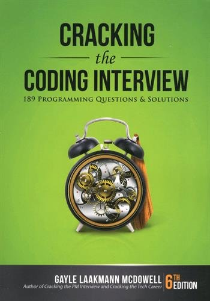

# Cracking the Coding Interview Questions

These are my solutions to some of the [Cracking the Coding Interview](http://www.crackingthecodinginterview.com/) (6th Edition) interview questions.

All solutions are implemented in Java.

## Compile and Run

The Java classes use no packages. So, to compile the solutions, go to the directory containing the Java file, and compile with:

~~~bash
javac MyClass.java
~~~

Then run with:

~~~bash
java MyClass
~~~
